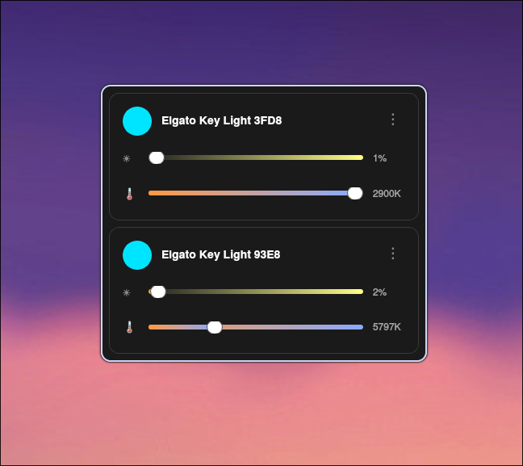

# Key Light Controller

A modern, standalone controller for Key Light devices with native Linux support for both X11 and Wayland. No Python or dependencies required when using the pre-built binary!



## Features

- 🔍 **Automatic device discovery** via mDNS/Bonjour
- 🎨 **Modern dark theme UI** styled to match professional control software
- 💡 **Real-time brightness control** (1-100% - prevents accidental off)
- 🌡️ **Color temperature control** (2900K-7000K)
- 🔧 **System tray integration** with minimize/restore
- ⚡ **Smooth, throttled updates** to prevent device overload
- 🖥️ **Native Wayland and X11 support** - works everywhere
- 🚀 **Single instance enforcement** - no duplicate windows
- 📦 **Standalone binary** - no installation required
- 🔄 **Dynamic window sizing** - adjusts to number of devices
- ⌨️ **Keyboard shortcuts** for quick control

## Compatibility

### Supported Systems
- **Linux**: All major distributions (Ubuntu, Fedora, Arch, Debian, etc.)
- **Display Servers**: X11, Wayland, XWayland
- **Python**: 3.8 or higher
- **Qt**: Uses PySide6 (Qt6)

## Quick Start (Pre-built Binary)

### Download Latest Release
1. Go to [Releases](https://github.com/yourusername/keylight-control-python/releases)
2. Download `keylight-controller-linux-x64.tar.gz`
3. Extract and run:

```bash
tar -xzf keylight-controller-linux-x64.tar.gz
chmod +x keylight-controller
./keylight-controller
```

That's it! No installation required.

## Installation Options

### Option 1: Standalone Binary (Easiest)
```bash
# Download from releases page
wget https://github.com/yourusername/keylight-control-python/releases/latest/download/keylight-controller
chmod +x keylight-controller
./keylight-controller

# Optional: Install system-wide
sudo mv keylight-controller /usr/local/bin/
```

### Option 2: Build from Source

#### Prerequisites
- Python 3.8+ (`python3 --version`)
- pip package installer

#### Install Dependencies
```bash
# Clone the repository
git clone https://github.com/yourusername/keylight-control-python.git
cd keylight-control-python

# Install dependencies
pip3 install --user -r requirements.txt

# Make executable
chmod +x keylight_controller.py

# Run
./keylight_controller.py
```

#### Method 2: Using Virtual Environment
```bash
# Create virtual environment
python3 -m venv venv
source venv/bin/activate

# Install dependencies
pip install -r requirements.txt

# Run
python keylight_controller.py
```

#### Method 3: System packages (Distribution-specific)

For Arch Linux:
```bash
sudo pacman -S python-pyside6 python-aiohttp python-zeroconf
pip install --user qasync
```

For Ubuntu 22.04+:
```bash
sudo apt install python3-pyside6.qtcore python3-pyside6.qtgui python3-pyside6.qtwidgets
pip3 install --user aiohttp zeroconf qasync
```

## Desktop Integration

### Create Desktop Entry
```bash
# Copy the desktop file
cp keylight-controller.desktop ~/.local/share/applications/

# Update desktop database
update-desktop-database ~/.local/share/applications/
```

### Add to PATH (Optional)
```bash
# Create symlink in local bin
ln -s $(pwd)/keylight_controller.py ~/.local/bin/keylight-controller

# Ensure ~/.local/bin is in PATH (add to ~/.bashrc if needed)
export PATH="$HOME/.local/bin:$PATH"
```

## Usage

### Launching
- **From Terminal**: `./keylight_controller.py` or `keylight-controller`
- **From Desktop**: Search for "Key Light Control" in your application launcher

### Controls
- **Power Button**: Toggle light on/off
- **Brightness Slider**: Adjust light intensity (0-100%)
- **Temperature Slider**: Adjust color temperature (2900K-7000K)
- **System Tray**: Click to show/hide, right-click for menu

### Keyboard Shortcuts
- **Ctrl+Q**: Quit application
- **Escape**: Minimize to system tray
- **Shift+Click X**: Force quit (bypass tray)

## Troubleshooting

### "No module named 'PySide6'"
```bash
pip3 install --user PySide6
```

### "qt.qpa.plugin: Could not find the Qt platform plugin"
For Wayland:
```bash
export QT_QPA_PLATFORM=wayland
```
For X11:
```bash
export QT_QPA_PLATFORM=xcb
```

### Permission Issues
If you get permission errors with pip:
```bash
pip3 install --user -r requirements.txt
```

### Multiple Python Versions
If you have multiple Python versions:
```bash
python3.8 -m pip install -r requirements.txt
python3.8 keylight_controller.py
```

### Device Not Found
- Ensure devices are on the same network
- Check firewall settings for mDNS (port 5353)
- Verify devices are powered on

## Dependencies

- **PySide6**: Qt6 bindings for Python
- **aiohttp**: Async HTTP client
- **zeroconf**: mDNS service discovery
- **qasync**: Qt async event loop integration

## License

GPL-3.0

## Contributing

Pull requests are welcome. For major changes, please open an issue first to discuss what you would like to change.