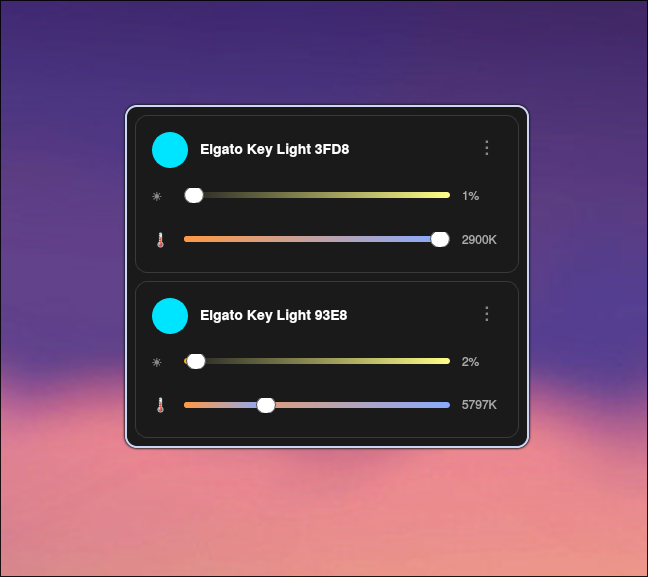

# Key Light Controller for Linux

A modern, standalone Linux alternative to Elgato's Control Center for Controlling Key Light devices. Native Linux support for both X11 and Wayland. Does not collect any data or "call home"



## Features

- 🔍 **Automatic device discovery** via mDNS/Bonjour
- 🎨 **Modern dark theme UI** styled to match professional control software
- 💡 **Real-time brightness control** (1-100% - prevents accidental off)
- 🌡️ **Color temperature control** (2900K-7000K)
- 🔧 **System tray integration** with minimize/restore
- ⚡ **Smooth, throttled updates** to prevent device overload
- 🖥️ **Native Wayland and X11 support** - works everywhere
- 🚀 **Single instance enforcement** - no duplicate windows
- 📦 **Standalone binary** - no installation required
- 🔄 **Dynamic window sizing** - adjusts to number of devices
- ⌨️ **Keyboard shortcuts** for quick control

## Compatibility

### Supported Systems
- **Linux**: All major distributions (Ubuntu, Fedora, Arch, Debian, etc.)
- **Display Servers**: X11, Wayland, XWayland
- **Python**: 3.8 or higher
- **Qt**: Uses PySide6 (Qt6)

## Quick Start (Pre-built Binary)

### Download Latest Release
1. Go to [Releases](https://github.com/sandwichfarm/keylight-control/releases)
2. Download `keylight-controller-linux-x64.tar.gz`
3. Extract and run:

```bash
tar -xzf keylight-controller-linux-x64.tar.gz
chmod +x keylight-controller
./keylight-controller
```

That's it! No installation required.

## Installation Options

### Option 1: Install from AUR (Arch Linux)

For Arch Linux and derivatives, you can easily install the controller from the [AUR](https://aur.archlinux.org/packages/keylight-controller).

```bash
yay -S keylight-controller
# or use your favorite AUR helper
```

### Option 2: Standalone Binary (Easiest)
```bash
# Download from releases page
wget https://github.com/sandwichfarm/keylight-control/releases/latest/download/keylight-controller-linux-x64.tar.gz
tar -xzf keylight-controller-linux-x64.tar.gz
chmod +x keylight-controller
./keylight-controller

# Optional: Install system-wide
sudo mv keylight-controller /usr/local/bin/
```

### Option 3: Build from Source

#### Prerequisites
- Python 3.8+ (`python3 --version`)
- pip package installer

#### Install Dependencies
```bash
# Clone the repository
git clone https://github.com/sandwichfarm/keylight-control.git
cd keylight-control

# Install dependencies
pip3 install --user -r requirements.txt

# Make executable
chmod +x keylight_controller.py

# Run
./keylight_controller.py
```

### Option 4: Using Virtual Environment
```bash
# Create virtual environment
python3 -m venv venv
source venv/bin/activate

# Install dependencies
pip install -r requirements.txt

# Run
python keylight_controller.py
```

### Option 5: System packages (Distribution-specific)

For Arch Linux:
```bash
sudo pacman -S python-pyside6 python-aiohttp python-zeroconf
pip install --user qasync
```

For Ubuntu 22.04+:
```bash
sudo apt install python3-pyside6.qtcore python3-pyside6.qtgui python3-pyside6.qtwidgets
pip3 install --user aiohttp zeroconf qasync
```

## Desktop Integration

### Create Desktop Entry
```bash
# Copy the desktop file
cp keylight-controller.desktop ~/.local/share/applications/

# Update desktop database
update-desktop-database ~/.local/share/applications/
```

### Add to PATH (Optional)
```bash
# Create symlink in local bin
ln -s $(pwd)/keylight_controller.py ~/.local/bin/keylight-controller

# Ensure ~/.local/bin is in PATH (add to ~/.bashrc if needed)
export PATH="$HOME/.local/bin:$PATH"
```

## Usage

### Launching
- **From Terminal**: `./keylight_controller.py` or `keylight-controller`
- **From Desktop**: Search for "Keylight Control" in your application launcher

### Controls
- **Power Button**: Toggle light on/off
- **Brightness Slider**: Adjust light intensity (1-100%)
- **Temperature Slider**: Adjust color temperature (2900K-7000K)
- **System Tray**: Click to show/hide, right-click for menu

### Keyboard Shortcuts
- **Ctrl+Q**: Quit application
- **Escape**: Minimize to system tray
- **Shift+Click X**: Force quit (bypass tray)

### Local API

A local API allows external scripts and window-manager keybindings to control your lights without interacting with the GUI. Two transports are available: a **Unix socket** (enabled by default) and an optional **HTTP server**.

#### Configuration

API settings are under **Settings → Advanced** in the application.

| Setting | Type | Default | Description |
|---|---|---|---|
| `advanced.api_enabled` | bool | `true` | Master switch — disables all API transports when off |
| `advanced.api_unix_socket` | bool | `true` | Enable the Unix socket transport |
| `advanced.api_http` | bool | `false` | Enable the HTTP transport |
| `advanced.api_http_port` | int | `27301` | Port for the HTTP server |

**Socket path:** `$XDG_RUNTIME_DIR/keylight-control.sock` (fallback: `/tmp/keylight-control.sock`). The socket is created with `0600` permissions (owner-only).

---

#### API Command Reference

| Command | Parameters | Description |
|---|---|---|
| `lights.list` | — | List all discovered devices and their current state |
| `lights.get` | `id` | Get the state of a single device |
| `lights.set` | `id`, and any of: `on`, `brightness`, `temperature` | Set one or more properties on a device |
| `lights.toggle` | — | Master toggle (all lights) |
| `lights.toggle` | `id` | Toggle an individual device on/off |

**Device `id`** — a 0-based integer index (`0`, `1`, …) or a MAC address string (`"AA:BB:CC:DD:EE:FF"`).

**Property constraints:**

| Property | Type | Range | Notes |
|---|---|---|---|
| `on` | bool | `true` / `false` | Power state |
| `brightness` | int | 1 – 100 | Percentage; clamped to range |
| `temperature` | int | 143 – 344 | Elgato native units (143 ≈ 7000 K, 344 ≈ 2900 K); clamped to range |

---

#### Response Format

Every response contains an `"ok"` field. On success additional data is included; on failure an `"error"` string is returned.

**Success (single device):**
```json
{
  "ok": true,
  "device": {
    "index": 0,
    "name": "Key Light",
    "ip": "192.168.1.100",
    "port": 9123,
    "mac": "AA:BB:CC:DD:EE:FF",
    "on": true,
    "brightness": 75,
    "temperature": 200
  }
}
```

**Success (device list):**
```json
{
  "ok": true,
  "devices": [
    { "index": 0, "name": "Key Light", "ip": "192.168.1.100", "port": 9123, "mac": "AA:BB:CC:DD:EE:FF", "on": true, "brightness": 75, "temperature": 200 },
    { "index": 1, "name": "Key Light Air", "ip": "192.168.1.101", "port": 9123, "mac": "BB:CC:DD:EE:FF:00", "on": false, "brightness": 50, "temperature": 250 }
  ]
}
```

**Error:**
```json
{
  "ok": false,
  "error": "Device index 5 out of range (0-1)"
}
```

---

#### Unix Socket Examples

The socket speaks newline-delimited JSON. Send a request object and read back one JSON line. [`socat`](https://linux.die.net/man/1/socat) is the easiest way to interact with it from the shell.

```bash
SOCK="$XDG_RUNTIME_DIR/keylight-control.sock"

# List all devices
echo '{"command":"lights.list"}' | socat - UNIX-CONNECT:$SOCK

# Get state of device 0
echo '{"command":"lights.get","params":{"id":0}}' | socat - UNIX-CONNECT:$SOCK

# Toggle all lights (master toggle)
echo '{"command":"lights.toggle"}' | socat - UNIX-CONNECT:$SOCK

# Toggle a single light by index
echo '{"command":"lights.toggle","params":{"id":0}}' | socat - UNIX-CONNECT:$SOCK

# Toggle a single light by MAC address
echo '{"command":"lights.toggle","params":{"id":"AA:BB:CC:DD:EE:FF"}}' | socat - UNIX-CONNECT:$SOCK

# Set brightness and temperature on device 0
echo '{"command":"lights.set","params":{"id":0,"brightness":80,"temperature":200}}' | socat - UNIX-CONNECT:$SOCK

# Turn off device 1
echo '{"command":"lights.set","params":{"id":1,"on":false}}' | socat - UNIX-CONNECT:$SOCK
```

---

#### HTTP API Reference

Enable the HTTP transport in **Settings → Advanced → Enable HTTP API**. It binds to `127.0.0.1` only.

| Method | Path | API Command | Notes |
|---|---|---|---|
| GET | `/api/lights` | `lights.list` | |
| GET | `/api/lights/{id}` | `lights.get` | |
| PUT | `/api/lights/{id}` | `lights.set` | Properties in JSON body or query string |
| POST | `/api/lights/toggle` | `lights.toggle` | Master toggle (all lights) |
| POST | `/api/lights/{id}/toggle` | `lights.toggle` | Toggle individual device |

Parameters can be passed as a JSON body (`Content-Type: application/json`) or as query-string parameters. Returns `200` on success, `400` on error.

```bash
# List all devices
curl http://localhost:27301/api/lights

# Get device 0
curl http://localhost:27301/api/lights/0

# Toggle all lights
curl -X POST http://localhost:27301/api/lights/toggle

# Toggle device 0
curl -X POST http://localhost:27301/api/lights/0/toggle

# Set brightness via JSON body
curl -X PUT http://localhost:27301/api/lights/0 \
  -H 'Content-Type: application/json' \
  -d '{"brightness":75}'

# Set brightness and temperature via query string
curl -X PUT "http://localhost:27301/api/lights/0?brightness=75&temperature=200"

# Turn device 1 off
curl -X PUT http://localhost:27301/api/lights/1 \
  -H 'Content-Type: application/json' \
  -d '{"on":false}'
```

---

#### Shell Helper Function

A small wrapper makes keybindings cleaner:

```bash
# Add to ~/.bashrc, ~/.zshrc, or a standalone script
keylight() {
  local sock="${XDG_RUNTIME_DIR}/keylight-control.sock"
  local cmd="$1"; shift
  local params=""
  if [ $# -gt 0 ]; then
    params=',"params":{'"$(printf '%s' "$@")"'}'
  fi
  echo "{\"command\":\"$cmd\"$params}" | socat - UNIX-CONNECT:"$sock"
}

# Usage:
#   keylight lights.toggle
#   keylight lights.list
#   keylight lights.set '"id":0,"brightness":80'
```

---

#### Compositor & Desktop Environment Keybindings

Below are copy-pasteable examples for binding light controls to keyboard shortcuts. All examples use the Unix socket; replace the `socat` command with a `curl` call if you prefer HTTP.

##### Hyprland

```conf
# ~/.config/hypr/hyprland.conf
bind = $mod, F5, exec, echo '{"command":"lights.toggle"}' | socat - UNIX-CONNECT:$XDG_RUNTIME_DIR/keylight-control.sock
bind = $mod, F6, exec, echo '{"command":"lights.set","params":{"id":0,"brightness":50}}' | socat - UNIX-CONNECT:$XDG_RUNTIME_DIR/keylight-control.sock
bind = $mod, F7, exec, echo '{"command":"lights.set","params":{"id":0,"brightness":100}}' | socat - UNIX-CONNECT:$XDG_RUNTIME_DIR/keylight-control.sock
```

##### sway

```conf
# ~/.config/sway/config
bindsym $mod+F5 exec echo '{"command":"lights.toggle"}' | socat - UNIX-CONNECT:$XDG_RUNTIME_DIR/keylight-control.sock
bindsym $mod+F6 exec echo '{"command":"lights.set","params":{"id":0,"brightness":50}}' | socat - UNIX-CONNECT:$XDG_RUNTIME_DIR/keylight-control.sock
bindsym $mod+F7 exec echo '{"command":"lights.set","params":{"id":0,"brightness":100}}' | socat - UNIX-CONNECT:$XDG_RUNTIME_DIR/keylight-control.sock
```

##### i3

```conf
# ~/.config/i3/config
bindsym $mod+F5 exec echo '{"command":"lights.toggle"}' | socat - UNIX-CONNECT:$XDG_RUNTIME_DIR/keylight-control.sock
bindsym $mod+F6 exec echo '{"command":"lights.set","params":{"id":0,"brightness":50}}' | socat - UNIX-CONNECT:$XDG_RUNTIME_DIR/keylight-control.sock
bindsym $mod+F7 exec echo '{"command":"lights.set","params":{"id":0,"brightness":100}}' | socat - UNIX-CONNECT:$XDG_RUNTIME_DIR/keylight-control.sock
```

##### KDE Plasma

1. Open **System Settings → Shortcuts → Custom Shortcuts**
2. Click **Edit → New → Global Shortcut → Command/URL**
3. Set the **Trigger** to your preferred key combination
4. Set the **Action** to:
   ```
   bash -c 'echo '"'"'{"command":"lights.toggle"}'"'"' | socat - UNIX-CONNECT:$XDG_RUNTIME_DIR/keylight-control.sock'
   ```

##### GNOME

```bash
# Toggle all lights on Super+F5
gsettings set org.gnome.settings-daemon.plugins.media-keys custom-keybindings "['/org/gnome/settings-daemon/plugins/media-keys/custom-keybindings/keylight-toggle/']"
gsettings set org.gnome.settings-daemon.plugins.media-keys.custom-keybinding:/org/gnome/settings-daemon/plugins/media-keys/custom-keybindings/keylight-toggle/ name 'Toggle Key Lights'
gsettings set org.gnome.settings-daemon.plugins.media-keys.custom-keybinding:/org/gnome/settings-daemon/plugins/media-keys/custom-keybindings/keylight-toggle/ binding '<Super>F5'
gsettings set org.gnome.settings-daemon.plugins.media-keys.custom-keybinding:/org/gnome/settings-daemon/plugins/media-keys/custom-keybindings/keylight-toggle/ command "bash -c 'echo '\"'\"'{\"command\":\"lights.toggle\"}'\"'\"' | socat - UNIX-CONNECT:$XDG_RUNTIME_DIR/keylight-control.sock'"
```

> **Tip:** For multiple GNOME keybindings, append additional paths to the `custom-keybindings` array and repeat the three `set` calls with a different path suffix.

## Troubleshooting

### "No module named 'PySide6'"
```bash
pip3 install --user PySide6
```

### "qt.qpa.plugin: Could not find the Qt platform plugin"
For Wayland:
```bash
export QT_QPA_PLATFORM=wayland
```
For X11:
```bash
export QT_QPA_PLATFORM=xcb
```

### Permission Issues
If you get permission errors with pip:
```bash
pip3 install --user -r requirements.txt
```

### Multiple Python Versions
If you have multiple Python versions:
```bash
python3.8 -m pip install -r requirements.txt
python3.8 keylight_controller.py
```

### Device Not Found
- Ensure devices are on the same network
- Check firewall settings for mDNS (port 5353)
- Verify devices are powered on

## Dependencies

- **PySide6**: Qt6 bindings for Python
- **aiohttp**: Async HTTP client
- **zeroconf**: mDNS service discovery
- **qasync**: Qt async event loop integration

## License

GPL-3.0

## Contributing

Pull requests are welcome. For major changes, please open an issue first to discuss what you would like to change.
